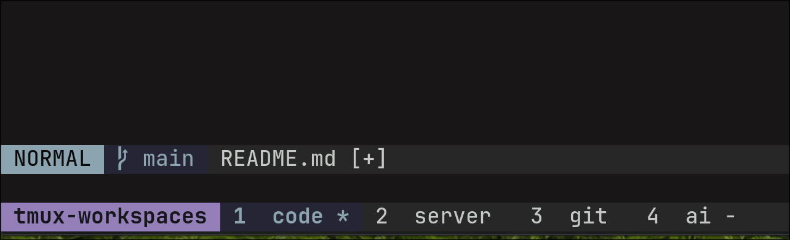
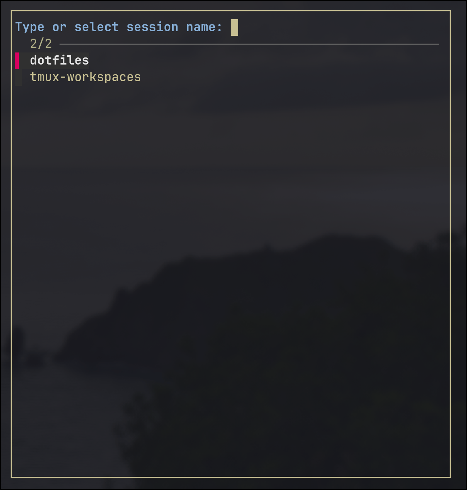

# tmux-workspaces

A simple workspace manager based on tmux sessions and fzf.

It provides a helper to create/select workspaces with four default windows:
code, server, git and ai.



A workspace is just a session. Tmux-workspaces will open a fzf popup screen where you can type the
name of a new workspace or select an existing one.
If you are creating a new workspace, fzf will prompt you the default directory for all windows.

## Dependencies

- [tpm](https://github.com/tmux-plugins/tpm)
- [fzf](https://github.com/junegunn/fzf)
- [fd](https://github.com/sharkdp/fd)

## Installation

Edit your .tmux.conf file and include the snippet bellow:

```conf
# create/manage workspaces using sessions
set -g @plugin 'dbittencourt/tmux-workspaces'

# initialize tmux plugin manager (this should be the last line of tmux.conf)
run '~/.tmux/plugins/tpm/tpm'
```

Afterwards, type your tmux prefix + `Ctrl-I` so tpm can download it locally.

## Default mappings

The default mappings rely on the alt key. They work just fine on linux but if you are a macos user,
you need to configure your terminal to identify option as alt.

- Alt + n: Trigger tmux-workspaces. You can type the name of a new workspace or select and
  switch to an existing one.



- Alt + r: Reset windows structure: code, server, git and ai;
- Alt + ` (grave): Switch between previous and current workspace;
- Alt + 1: Switch to window 1 (code);
- Alt + 2: SWitch to window 2 (server);
- Alt + 3: Switch to window 3 (git);
- Alt + 4: Switch to window 4 (ai).
